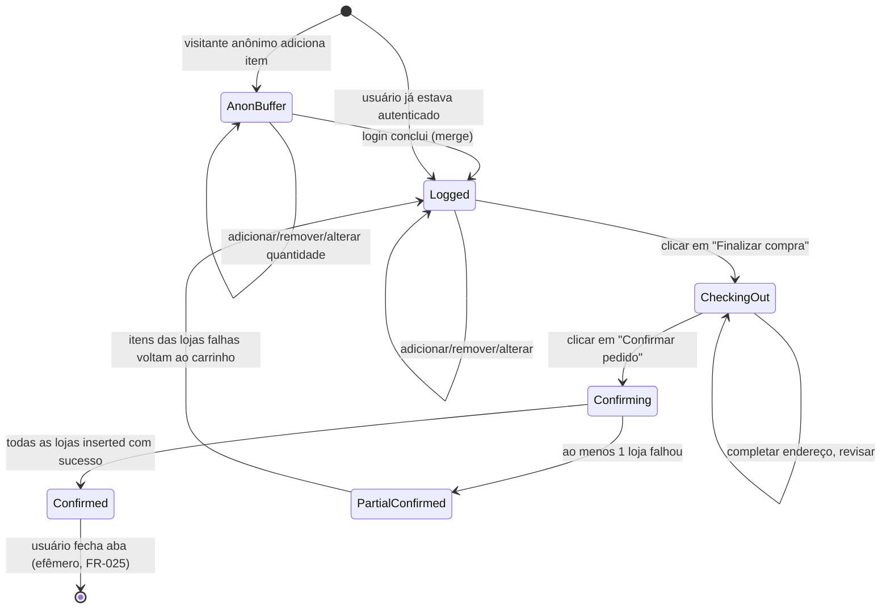

# Phase 1 — Data Model

**Date**: 2026-04-27
**Plan**: [plan.md](./plan.md)
**Spec**: [spec.md](./spec.md)

> **Note**: este modelo descreve as **shapes consumidas pelo frontend**. Os tipos
> `ProductInfo`, `StoreInfo`, `CategoryInfo`, `ProductImageInfo`, `ShopCartInfo` e
> `ShopCartItemInfo` são **re-exportados de `lofn-react`** (decisão D15). Os tipos
> próprios do Circulou (`SearchParams`, `FilterState`, `SortBy`, `CartState`,
> `OrderConfirmation`, `MockOrderId`, `Address`, etc.) ficam em `src/types/`.

## 1. Entidades de domínio (re-exportadas de `lofn-react`)

### 1.1 Store

```ts
interface StoreInfo {
  storeId: number;
  ownerId: number;
  slug: string;
  name: string;
  logo?: string;
  logoUrl?: string;
  status: StoreStatusEnum; // Active | Inactive
}
```

- **Identidade**: `storeId` único globalmente; `slug` é único e usado em URLs.
- **Visibilidade**: o frontend exibe apenas lojas com `status === Active` (FR-001
  "todas as lojas ativas"). Filtragem é client-side caso o resolver GraphQL `stores`
  ainda não filtre — registrar como reforço, não como gap (LOFN-G07 cobre).
- **Relações**: 1:N → `Product`, `Category`.

### 1.2 Product

```ts
interface ProductInfo {
  productId: number;
  storeId: number;
  categoryId?: number;
  slug: string;
  name: string;
  description: string;          // markdown
  price: number;                // double
  discount: number;             // valor absoluto descontado
  frequency: number;            // 0 = avulso; >0 = recorrência em dias
  limit: number;                // máximo por compra
  status: ProductStatusEnum;    // Active | Inactive
  productType: ProductTypeEnum;
  featured: boolean;
  imageUrl?: string;
  images?: ProductImageInfo[];
  createdAt: string;            // ISO 8601
  updatedAt: string;            // ISO 8601
  stripeProductId?: string;
  stripePriceId?: string;
  // injected client-side at search time, not from API
  store?: StoreInfo;
}
```

- **Identidade**: `productId` único globalmente; `(storeSlug, slug)` é a chave de URL.
- **`store?`**: campo extra, **populado pelo frontend** após a busca cross-store, lookup
  na lista de lojas conhecidas pelo `storeId`. Necessário para FR-002 (card mostra nome
  da loja).
- **Validações ao adicionar ao carrinho**:
  - `status === Active` && `store.status === Active` (senão FR-021 / FR-026).
  - `quantity ≤ limit` (FR-020).
- **Relações**: N:1 → `Store`; N:1 (opcional) → `Category`; 1:N → `ProductImage`.

### 1.3 Category

```ts
interface CategoryInfo {
  categoryId: number;
  storeId: number;
  slug: string;
  name: string;
  productCount: number;
}
```

- **Escopo**: per-loja (Clarification Q3 + Assumption "Catálogo unificado por busca").
  Não há entidade de "categoria global".
- **Relações**: N:1 → `Store`; 1:N → `Product`.

### 1.4 ProductImage

```ts
interface ProductImageInfo {
  imageId: number;
  productId: number;
  image?: string;
  imageUrl?: string;
  sortOrder: number;
}
```

- **Renderização**: galeria ordenada por `sortOrder`. Imagem principal = primeira ou
  `product.imageUrl` se disponível. Imagem ausente → placeholder neutro (Edge Case).

### 1.5 ShopCartItemInfo

```ts
interface ShopCartItemInfo {
  product: ProductInfo;
  quantity: number;
}
```

### 1.6 ShopCartInfo

```ts
interface ShopCartInfo {
  user: UserInfo;                  // de NAuth
  address: ShopCartAddressInfo;
  items: ShopCartItemInfo[];
  createdAt: string;               // ISO 8601
}

interface ShopCartAddressInfo {
  zipCode: string;
  address: string;
  complement?: string;
  neighborhood: string;
  city: string;
  state: string;
}
```

- **Uso no Circulou**: `ShopCartInfo` é construído **uma vez por loja** no momento do
  checkout (FR-024). Antes do checkout, o estado vive em `CartState` (próprio do
  Circulou; ver §2.4).

## 2. Entidades específicas do Circulou (`src/types/`)

### 2.1 SearchParams

```ts
interface SearchParams {
  keyword: string;          // termo digitado, normalizado (sem diacríticos)
  storeId?: number;         // filtro "loja específica" (FR-005)
  pageNum: number;          // 1-based
  onlyActive: boolean;      // sempre true no Circulou
}
```

- Mapeia 1:1 sobre `ProductSearchParam` aceito por `POST /product/search` (excluindo
  `userId`, `userSlug`, `networkSlug` que não fazem sentido neste produto).

### 2.2 FilterState (estado client-side dos filtros e ordenação)

```ts
interface FilterState {
  keyword: string;
  storeId?: number;
  minPrice?: number;        // mock LOFN-G01
  maxPrice?: number;        // mock LOFN-G01
  onlyOnSale: boolean;      // mock LOFN-G02
  categoryId?: number;      // só no escopo de StorePage (FR-011)
  sortBy: SortBy;           // mock LOFN-G03
}

type SortBy =
  | 'relevance'             // padrão; calculado em src/lib/relevance.ts
  | 'priceAsc'
  | 'priceDesc'
  | 'discountDesc'
  | 'recent';
```

- **URL projection (FR-009)**: `FilterState` é serializado em query string via
  `useUrlSearchState`. Convenção: `q=`, `store=`, `min=`, `max=`, `sale=1`, `cat=`,
  `sort=`. `categoryId` só aparece em URLs de `StorePage`.

### 2.3 SearchPage (resultado paginado, pós pré-fetch progressivo)

```ts
interface SearchPage {
  items: ProductInfo[];     // até 12 itens visíveis pós-filtro
  totalFetched: number;     // contagem corrente do conjunto agregado pelo pré-fetch
  fetchedPages: number;     // 1..N (cap atual)
  pageCap: number;          // teto vigente (5, 10, 15, ... — sobe com "Buscar mais")
  exhausted: boolean;       // true quando o servidor sinalizou ausência de mais páginas
}
```

- **Transições do `pageCap`**: começa em `5`. Botão "Buscar mais" → `pageCap += 5`.
  Quando `exhausted === true`, o botão fica desabilitado/oculto.

### 2.4 CartState (estado do carrinho no front)

```ts
interface CartItem {
  product: ProductInfo;
  quantity: number;          // 1..product.limit
}

interface CartState {
  userId: string | null;     // null quando o estado refere ao buffer pré-login
  items: CartItem[];         // todos os itens; o agrupamento por loja é derivado em runtime
  updatedAt: string;         // ISO 8601 — usado por last-write-wins lógico (FR-019)
}
```

- **Persistência** (D8):
  - Logado: `localStorage["circulou:cart:{userId}"]`.
  - Anônimo: `sessionStorage["circulou:cart:anon"]`.
- **Last-write-wins (FR-019)**: cada `set` sobrescreve completamente o blob, gravando
  `updatedAt` atual. Em um único dispositivo isto é trivial; quando LOFN-G09 fechar
  e mover persistência para o servidor, o `updatedAt` vira critério para a comparação.
- **Merge no login (FR-017)**: ao detectar transição "anônimo → autenticado",
  `CartContext`:
  1. Lê o buffer `sessionStorage["circulou:cart:anon"]`.
  2. Lê o carrinho do usuário em `localStorage["circulou:cart:{userId}"]`.
  3. Para cada item do buffer, soma quantidades em itens existentes do carrinho
     respeitando `limit` (recorta no `limit` se exceder).
  4. Grava o resultado em `localStorage` com `updatedAt = now`.
  5. Apaga `sessionStorage["circulou:cart:anon"]`.

### 2.5 Address

```ts
interface Address {
  addressId: string;         // UUID gerado client-side (mock LOFN-G13)
  zipCode: string;
  address: string;
  complement?: string;
  neighborhood: string;
  city: string;
  state: string;
  isDefault: boolean;        // mock LOFN-G14
  createdAt: string;         // ISO 8601
}
```

- **Persistência**: `localStorage["circulou:addresses:{userId}"]` — array de `Address`.
- **Invariantes**:
  - No máximo um endereço com `isDefault === true` por usuário. Ao marcar um novo
    como default, todos os outros são revertidos para `false`.
  - Remoção do default elege o mais recente (`createdAt` desc) como novo default.

### 2.6 OrderConfirmation (efêmera — FR-025)

```ts
interface MockOrderId {
  storeSlug: string;
  storeName: string;
  orderId: string;            // formato MOCK-{storeSlug}-{YYYYMMDD-HHmmss}-{rand5}
  items: CartItem[];
  subtotal: number;
  status: 'submitted' | 'failed';
  errorMessage?: string;
}

interface OrderConfirmation {
  createdAt: string;
  shippingAddress: Address;
  results: MockOrderId[];     // um por loja envolvida
  totalAll: number;
}
```

- **Vida**: existe **apenas no `state` da `OrderConfirmationPage`** durante a sessão.
  Não vai para `localStorage` (Q4 da clarify). Fechar a aba apaga.

## 3. Domínios externos referenciados

### 3.1 NAuth (não modelado aqui)

```ts
// re-exportado de nauth-react
interface UserInfo {
  userId: number;
  name: string;
  email: string;
}
```

- A leitura/atualização do `UserInfo` é feita via `useAuth` do `nauth-react`. O
  Circulou não armazena dados de identidade além do que NAuth já provê.

## 4. Transições de estado relevantes

### 4.1 Carrinho — máquina de estados simplificada



### 4.2 Endereços — restrições de transição

| De → Para | Regra |
|---|---|
| (qualquer) → criar | Permitido sempre. Se `isDefault=true` na criação, força os demais a `false`. |
| `isDefault=true` → atualizar (mantendo default) | OK. |
| `isDefault=true` → remover | Após remoção, eleger automaticamente o `Address` com maior `createdAt` como novo default. Se a lista ficar vazia, o checkout volta a exigir cadastro (FR-023). |

### 4.3 Sessão NAuth

| Evento | Reação no Circulou |
|---|---|
| Token presente em `localStorage` | `AuthContext` carrega `UserInfo`, hidrata carrinho/endereços do `localStorage` por `userId`. |
| Login bem-sucedido | Disparar `mergeAnonBuffer()` no `CartContext`. |
| Logout explícito | Limpar `AuthContext`; **manter** `circulou:cart:{userId}` e `circulou:addresses:{userId}` em `localStorage` para reconstrução em login posterior. |
| 401 da API | `HttpClient` dispara `auth:expired` → `AuthContext` redireciona ao login (FR-016) preservando intenção via `state.from`. |

## 5. Mapeamento FR ↔ Entidade

| FR | Entidades primárias |
|---|---|
| FR-001..FR-004 | `SearchParams`, `FilterState`, `SearchPage`, `ProductInfo`, `StoreInfo` |
| FR-005..FR-009 | `FilterState`, `SearchPage` |
| FR-010..FR-012 | `ProductInfo`, `ProductImageInfo`, `StoreInfo`, `CategoryInfo` |
| FR-013..FR-016 | `UserInfo` (NAuth), `AuthContext` |
| FR-017..FR-021 | `CartItem`, `CartState`; transições §4.1 |
| FR-022..FR-026 | `OrderConfirmation`, `MockOrderId`, `ShopCartInfo`, `Address` |
| FR-027..FR-030 | nenhuma entidade dedicada (cross-cutting) |

## 6. Dados que **não** modelamos neste MVP

- **Histórico de pedidos** (gap LOFN-G12, fora de escopo).
- **Avaliações / reviews / ratings** (Assumption — fora de escopo).
- **Wishlist / favoritos** (Assumption — fora de escopo).
- **Pagamento / frete** (Assumption — fora de escopo).
- **Métricas/observabilidade** (planning later — não bloqueia funcionalidade).
