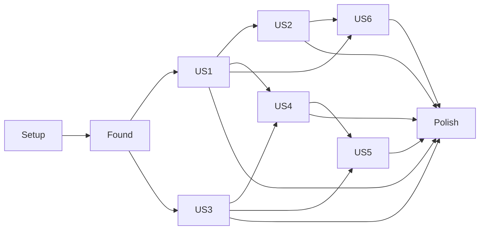

# Tasks: Circulou — Marketplace Unificado de Produtos

**Input**: Design documents from `C:\repos\circulou-app\specs\001-circulou-marketplace\`
**Prerequisites**: plan.md (✅), spec.md (✅), research.md (✅), data-model.md (✅), contracts/ (✅), quickstart.md (✅), lofn-api-gaps.md (✅)
**Branch**: `001-circulou-marketplace`

**Tests**: Não foram explicitamente solicitados na spec. Vitest + RTL + MSW estão configurados em Phase 1 (decisão D1 do `research.md`) para que tarefas de teste possam ser adicionadas posteriormente sem reinstalação. **Nenhuma tarefa de teste é obrigatória neste plano**; testes ficam a critério do engenheiro responsável por cada entrega.

**Organization**: Tarefas agrupadas por user story para permitir implementação e validação independentes (Setup → Foundational → US1 → US2 → US3 → US4 → US5 → US6 → Polish).

## Format: `[ID] [P?] [Story] Description with file path`

- **[P]**: Pode rodar em paralelo (arquivos diferentes, sem dependências em tarefa pendente)
- **[Story]**: Marca a user story (ex.: [US1]) — ausente em Setup/Foundational/Polish
- Caminhos absolutos partem de `C:\repos\circulou-app\` (raiz do repo)

> **Convenção MOCK ancorada** (Assumption "Restrição de backend"): toda tarefa que cria mock para um gap LOFN-G## deve incluir, na linha imediatamente acima do código mock, o comentário `// MOCK :: LOFN-G## — <descrição>. Ver specs/001-circulou-marketplace/lofn-api-gaps.md#lofn-g##.` Isso é exigência de cada tarefa marcada com `LOFN-G##` abaixo, não tarefa separada.

## Phase 1: Setup (Shared Infrastructure)

**Purpose**: Inicializar o projeto Vite + React 18 + TypeScript 5 conforme constituição v1.0.0 e plan.md.

- [X] T001 Inicializar projeto Vite 6 + React 18 + TypeScript 5 na raiz `C:\repos\circulou-app\` (criar `package.json`, `index.html`, `vite.config.ts`, `tsconfig.json`, `tsconfig.node.json`, `src/main.tsx`, `src/App.tsx`)
- [X] T002 [P] Configurar `tsconfig.json` em modo `strict: true`, `noUncheckedIndexedAccess: true`, paths alias `@/*` para `src/*` em `C:\repos\circulou-app\tsconfig.json`
- [X] T003 [P] Configurar ESLint com `eslint-plugin-react`, `eslint-plugin-react-hooks` e `@typescript-eslint` em `C:\repos\circulou-app\.eslintrc.cjs`; alinhar regras às convenções IV da constituição (PascalCase, camelCase, UPPER_CASE)
- [X] T004 [P] Adicionar Vitest 1.x + `@testing-library/react` + `@testing-library/user-event` + MSW; criar `C:\repos\circulou-app\vitest.config.ts` e `C:\repos\circulou-app\src\test\setup.ts`
- [X] T005 [P] Criar a estrutura de diretórios respeitando o casing do Princípio III: `C:\repos\circulou-app\src\Contexts\`, `src\Services\`, `src\hooks\`, `src\types\`, `src\components\`, `src\pages\`, `src\i18n\`, `src\lib\`, `src\styles\`, `public\locales\pt-BR\`
- [X] T006 Instalar dependências de domínio: `lofn-react`, `nauth-react@0.7.x`, `react-router-dom@6.x`, `bootstrap@5.x`, `i18next@25.x`, `react-i18next@latest`, `sonner`, `react-markdown`, `remark-gfm` em `C:\repos\circulou-app\package.json`
- [X] T007 Criar `C:\repos\circulou-app\.env.example` listando `VITE_API_URL`, `VITE_LOFN_GRAPHQL_URL`, `VITE_SITE_BASENAME` (Princípio VI; sem `REACT_APP_*`)
- [X] T008 [P] Configurar i18next em `C:\repos\circulou-app\src\i18n\index.ts` com backend HTTP carregando `/locales/pt-BR/translation.json`; criar arquivo seed `C:\repos\circulou-app\public\locales\pt-BR\translation.json` com chaves vazias dos namespaces `common`, `search`, `cart`, `checkout`, `auth`, `errors`
- [X] T009 [P] Importar Bootstrap 5 SCSS e tema customizado em `C:\repos\circulou-app\src\styles\theme.scss` (overrides de cores primária/secundária, raios, tipografia); importar em `src\main.tsx`
- [X] T010 [P] Adicionar scripts npm `dev`, `build`, `preview`, `test`, `test:watch`, `lint`, `typecheck` em `C:\repos\circulou-app\package.json`
- [X] T011 Configurar React Router 6 com `createBrowserRouter` em `C:\repos\circulou-app\src\App.tsx` e placeholders para todas as rotas: `/` (home), `/search`, `/loja/:storeSlug`, `/product/:storeSlug/:productSlug`, `/login`, `/register`, `/forgot-password`, `/reset-password`, `/change-password`, `/profile`, `/cart`, `/checkout`, `/order-confirmation`, e fallback `*` → `NotFoundPage`. Rotas não-MVP renderizam `<UnderConstruction />` placeholder ou redirecionam para `/` durante o MVP (Setup + Foundational + US1)
- [X] T012 Configurar provider chain skeleton em `C:\repos\circulou-app\src\main.tsx` com placeholder vazio `<RouterProvider>` envolto em `<I18nextProvider>` (mais providers serão registrados pelo skill `react-architecture` em fases seguintes)
- [X] T013 [P] Criar `C:\repos\circulou-app\.gitignore` cobrindo `dist/`, `node_modules/`, `.env.local`, `coverage/`, `.vite/`

**Checkpoint**: `npm run dev` levanta o servidor e renderiza uma página em branco sem erros de typecheck/lint.

---

## Phase 2: Foundational (Blocking Prerequisites)

**Purpose**: Infraestrutura compartilhada por todas as user stories. **Nenhuma user story pode começar até este checkpoint.**

- [X] T014 [P] Implementar `C:\repos\circulou-app\src\Services\HttpClient.ts` — wrapper sobre `fetch` com: leitura do token via `localStorage["login-with-metamask:auth"]` (Princípio V), header `Authorization: Basic {token}`, serialização JSON, mapeamento de erros HTTP para `LofnApiError`, suporte a `AbortSignal`, dispatch de evento `auth:expired` em 401 (FR-016)
- [X] T015 [P] Implementar `C:\repos\circulou-app\src\lib\normalize.ts` — função `normalizeText(s)` removendo diacríticos comuns do português e aplicando `toLowerCase` (FR-001)
- [X] T016 [P] Implementar `C:\repos\circulou-app\src\lib\currency.ts` — formatação BRL para preços e descontos
- [X] T017 [P] Implementar `C:\repos\circulou-app\src\lib\slug.ts` — geração e validação de slugs (uso em URLs e identificação de produto)
- [X] T018 [P] Implementar `C:\repos\circulou-app\src\lib\pagination.ts` — utilitário do pré-fetch progressivo (cap começa em 5; helpers para subir +5 e detectar exhausted)
- [X] T019 [P] Implementar `C:\repos\circulou-app\src\lib\relevance.ts` — ranqueamento `match-exato → prefixo → substring → featured → recente` (FR-006)
- [X] T020 [P] Definir tipos compartilhados re-exportando do `lofn-react` em `C:\repos\circulou-app\src\types\product.ts`, `store.ts`, `category.ts`, `image.ts` (Decisão D15)
- [X] T021 [P] Definir tipos próprios do Circulou em `C:\repos\circulou-app\src\types\search.ts` (`SearchParams`, `FilterState`, `SortBy`, `SearchPage`), `cart.ts` (`CartItem`, `CartState`), `address.ts` (`Address`), `order.ts` (`MockOrderId`, `OrderConfirmation`)
- [X] T022 [P] Implementar componentes de UI base em `C:\repos\circulou-app\src\components\ui\`: `EmptyState.tsx`, `ErrorState.tsx`, `LoadingSpinner.tsx`, `Pagination.tsx`
- [X] T023 [P] Implementar layout base em `C:\repos\circulou-app\src\components\layout\`: `Header.tsx` (logo Circulou, busca, link de login/perfil, badge do carrinho — placeholders), `Footer.tsx`, `Layout.tsx`
- [X] T024 [P] Implementar hook `C:\repos\circulou-app\src\hooks\useUrlSearchState.ts` — leitura/escrita de `q`, `store`, `min`, `max`, `sale`, `cat`, `sort`, `page` na URL via `useSearchParams` do RR6 (FR-009)
- [X] T025 [P] Implementar hook `C:\repos\circulou-app\src\hooks\useDebounce.ts` — utilitário (não usado pela busca, que é on-confirm; reservado para campos numéricos de filtro)
- [X] T026 Configurar global `Toaster` (`sonner`) em `C:\repos\circulou-app\src\main.tsx` para exibir mensagens de erro/sucesso (FR-030)
- [X] T027 Implementar Error Boundary global em `C:\repos\circulou-app\src\components\ui\AppErrorBoundary.tsx` e envolvê-lo em `main.tsx` para evitar telas em branco (SC-006)

**Checkpoint**: Foundation pronta — User Stories podem começar em paralelo (com as dependências marcadas).

---

## Phase 3: User Story 1 — Buscar produtos cross-store (Priority: P1) 🎯 MVP

**Goal**: O visitante digita um termo e recebe uma lista paginada com produtos de todas as lojas, com nome da loja em cada card. Sem termo, vê a home com `featured → recente`.

**Independent Test**: cadastrar produtos com o termo "café" em 2+ lojas via API Lofn, abrir a home e digitar "café" → resultados misturados aparecem com o nome da loja em cada card.

### Implementação para User Story 1

- [X] T028 [US1] Invocar o skill `/react-architecture` para a entidade **Products** — gera `Services/ProductsService.ts`, `Contexts/ProductsContext.tsx`, `hooks/useProducts.ts` e registra `<ProductsProvider>` em `C:\repos\circulou-app\src\main.tsx` conforme padrão do skill
- [X] T029 [US1] Implementar em `C:\repos\circulou-app\src\Services\ProductsService.ts` o método `searchUnified(filters)` chamando `POST {VITE_API_URL}/product/search` sem `storeId` (FR-001), normalizando o keyword com `normalizeText`, com pré-fetch progressivo (até 5 páginas, máx 2 in-flight) e retornando `SearchPage` (referenciar contracts/search.md §3)
- [X] T030 [P] [US1] Implementar `ProductsService.loadHome()` em `C:\repos\circulou-app\src\Services\ProductsService.ts` — tentar GraphQL `featuredProducts`, fallback para `searchUnified` ordenado por mais recentes; decidir título "Em destaque" vs "Catálogo" (FR-004); marcar fallback com `// MOCK :: LOFN-G04`
- [X] T031 [P] [US1] Implementar `ProductsService.searchInStore(storeId, filters)` em `C:\repos\circulou-app\src\Services\ProductsService.ts` (alimenta US2/US6 também, mas desbloqueia o fallback de detalhe sem impacto direto em US1)
- [X] T032 [P] [US1] Implementar `applyFilters` e `applySort` em `C:\repos\circulou-app\src\Services\ProductsService.ts` (chamadas em-memória sobre o conjunto pré-fetched; rotacionar `relevance.ts` como default sort)
- [X] T033 [US1] Implementar `useProducts` em `C:\repos\circulou-app\src\hooks\useProducts.ts` expondo `searchPage`, `loading`, `error`, `clearError`, `extendCap()` (botão "Buscar mais"), e leitura/escrita do `FilterState` via `useUrlSearchState`
- [X] T034 [US1] Implementar `C:\repos\circulou-app\src\components\search\SearchBar.tsx` — input controlado + botão "Buscar"; **dispara busca SOMENTE em Enter ou clique no botão** (FR-001 esclarecido); sem dropdown de sugestões
- [X] T035 [US1] Implementar `C:\repos\circulou-app\src\components\product\ProductCard.tsx` exibindo nome, imagem (com fallback `placeholder`), preço, badge de desconto (quando `discount > 0`), nome da loja com link para `/loja/{storeSlug}` (FR-002); ao clicar no card, navegar para `/product/{storeSlug}/{productSlug}` passando `state: { product }` (Decisão D10)
- [X] T036 [US1] Implementar `C:\repos\circulou-app\src\components\product\ProductGrid.tsx` — grid responsivo Bootstrap (12 itens / 360 px+) consumindo a lista do `useProducts`
- [X] T037 [US1] Implementar `C:\repos\circulou-app\src\components\product\PriceTag.tsx` — formatação BRL via `currency.ts`, mostra preço final e preço original riscado quando há desconto
- [X] T038 [US1] Implementar `C:\repos\circulou-app\src\pages\HomePage.tsx` — chama `useProducts().loadHome()`; renderiza título dinâmico ("Em destaque" / "Catálogo") + `ProductGrid`; trata estado de loading (LoadingSpinner) e erro (ErrorState com retry)
- [X] T039 [US1] Implementar `C:\repos\circulou-app\src\pages\SearchResultsPage.tsx` — lê `q` da URL via `useUrlSearchState`, chama `useProducts().searchUnified()`; quando `q === ""` redireciona para `/`; trata estado vazio com mensagem "Nenhum produto encontrado para '{termo}'" (FR-001 cenário 2)
- [X] T040 [US1] Wire de roteamento em `C:\repos\circulou-app\src\App.tsx`: `/` → `HomePage`, `/search` → `SearchResultsPage`; conectar `SearchBar` no `Header.tsx` para que Enter navegue para `/search?q=...`

**Checkpoint US1**: P1 entregue — descoberta cross-store funciona. Independente de auth/carrinho. **MVP demoável.**

---

## Phase 4: User Story 2 — Filtros e ordenação unificados (Priority: P2)

**Goal**: Visitante refina os resultados por loja, faixa de preço, "apenas em promoção" e ordena por relevância/preço/desconto/recente. Filtros refletem na URL e suportam pré-fetch progressivo (FR-007). **Categoria não aparece** na busca unificada (Clarification Q3).

**Dependency**: US1 (precisa de `useProducts` e dos filtros já implementados em T032).

### Implementação para User Story 2

- [X] T041 [US2] Invocar o skill `/react-architecture` para a entidade **Stores** — gera `Services/StoresService.ts`, `Contexts/StoresContext.tsx`, `hooks/useStores.ts` e registra `<StoresProvider>` em `C:\repos\circulou-app\src\main.tsx`
- [X] T042 [P] [US2] Implementar `StoresService.listAll()` em `C:\repos\circulou-app\src\Services\StoresService.ts` chamando GraphQL `stores` via `HttpClient` em `POST {VITE_LOFN_GRAPHQL_URL}` (referenciar `contracts/store.md`); cachear em memória; filtro `status === Active` client-side
- [X] T043 [P] [US2] Implementar `StoresService.getBySlug(slug)` em `C:\repos\circulou-app\src\Services\StoresService.ts` chamando GraphQL `storeBySlug` com fragmento `categories[]` aninhado (alimenta US6 também)
- [X] T044 [US2] Implementar `C:\repos\circulou-app\src\components\search\FiltersPanel.tsx` — controles para: dropdown "Loja" (alimentado por `useStores()`), inputs `min`/`max` (faixa de preço), checkbox "Apenas em promoção", botão "Limpar filtros" (FR-005, FR-008); **NÃO** incluir filtro de categoria (Clarification Q3)
- [X] T045 [US2] Implementar `C:\repos\circulou-app\src\components\search\SortControl.tsx` — dropdown com opções "Relevância" (default), "Menor preço", "Maior preço", "Maior desconto", "Mais recentes" (FR-006)
- [X] T046 [US2] Implementar `C:\repos\circulou-app\src\components\search\LoadMoreButton.tsx` — botão "Buscar mais" que chama `extendCap()` do `useProducts`; só aparece quando `searchPage.fetchedPages >= searchPage.pageCap && !searchPage.exhausted` (FR-007)
- [X] T047 [US2] Integrar `FiltersPanel`, `SortControl` e `LoadMoreButton` na `SearchResultsPage.tsx` em `C:\repos\circulou-app\src\pages\SearchResultsPage.tsx`; mostrar contagem corrente "X resultados encontrados" quando o teto progressivo for atingido sem completar 12
- [X] T048 [US2] Estender `useUrlSearchState` em `C:\repos\circulou-app\src\hooks\useUrlSearchState.ts` para serializar/parsear `store`, `min`, `max`, `sale`, `sort`, `page` (FR-009); decodificar `q` corretamente; testar reprodução exata do estado em uma nova sessão

**Checkpoint US2**: filtros + ordenação + paginação progressiva entregues. URL é compartilhável. Demoável independentemente.

---

## Phase 5-pre: Spike — Compatibilidade NAuth × Constituição V

**Purpose**: validar antes de US3 que o token emitido por `nauth-react` é compatível com o esquema `Authorization: Basic {token}` exigido pela constituição (Princípio V) e aceito pelo backend Lofn. Spike caixa-preta de até 1 dia. **Bloqueia início de Phase 5.**

- [X] T048a Spike de validação NAuth × Lofn — autenticar manualmente via `nauth-react` num ambiente de dev, capturar o token bruto retornado, compor o header `Authorization: Basic {token}` e disparar uma chamada autenticada (ex.: `POST /shopcart/insert` com payload mínimo) contra o Lofn. Documentar evidência em `C:\repos\circulou-app\specs\001-circulou-marketplace\research-nauth-spike.md` cobrindo: (a) formato do token devolvido (Bearer JWT, opaque, base64, etc.), (b) se o Lofn aceita `Basic {token}` com esse valor, (c) cabeçalhos efetivamente enviados, (d) corpo da resposta. **Resultado**: spike resolvido por **análise de fontes** (sem ambiente live acessível). Achados: NAuth armazena token em `localStorage["nauth_token"]` por default — alinhamos via `storageKey: "login-with-metamask:auth"`; NAuth envia `Authorization: Bearer {token}` para o próprio backend NAuth, mas nosso `HttpClient.ts` lê o mesmo token e envia `Authorization: Basic {token}` para o Lofn (Princípio V). A pergunta empírica "Lofn aceita `Basic {token-NAuth}`?" fica como dívida NAUTH-S1 (validar na primeira request autenticada de US5). Detalhes em `research-nauth-spike.md`.

**Checkpoint Phase 5-pre**: integração de auth validada e documentada antes de qualquer FR de auth ser tocado em código.

---

## Phase 5: User Story 3 — Autenticação (Priority: P2)

**Goal**: Visitante cria conta, faz login, recupera senha, atualiza perfil. Sessão expirada redireciona ao login mantendo intenção (FR-016).

**Dependency**: nenhuma além da Phase 2.

### Implementação para User Story 3

- [X] T049 [US3] Invocar o skill `/react-architecture` para a entidade **Auth** — gera `Services/AuthService.ts`, `Contexts/AuthContext.tsx`, `hooks/useAuth.ts` e registra `<AuthProvider>` em `C:\repos\circulou-app\src\main.tsx`. O `AuthService` é wrapper sobre os hooks oficiais de `nauth-react`
- [X] T050 [US3] Implementar `AuthService.getHeaders()` em `C:\repos\circulou-app\src\Services\AuthService.ts` lendo `localStorage["login-with-metamask:auth"]` e devolvendo `{ Authorization: 'Basic {token}' }` (constituição V); fonte única consumida por todos os Services via `HttpClient`
- [X] T051 [US3] Wirear emissão de evento `auth:expired` no `HttpClient` (T014) → `AuthContext` ouve e dispara redirect para `/login` com `state.from = pathname+search` para retomar pós-login (FR-016)
- [X] T052 [P] [US3] Implementar `C:\repos\circulou-app\src\pages\LoginPage.tsx` + `C:\repos\circulou-app\src\components\auth\LoginForm.tsx` consumindo o hook de login do `nauth-react`; exibir erros inline; após sucesso, navegar para `state.from || '/'` (usado o `LoginForm` direto do nauth-react — não precisou wrapper próprio)
- [X] T053 [P] [US3] Implementar `C:\repos\circulou-app\src\pages\RegisterPage.tsx` + `C:\repos\circulou-app\src\components\auth\RegisterForm.tsx` (FR-013); após cadastro bem-sucedido, navegar para `/` autenticado (usado `RegisterForm` direto)
- [X] T054 [P] [US3] Implementar `C:\repos\circulou-app\src\pages\ForgotPasswordPage.tsx` (FR-014)
- [X] T055 [P] [US3] Implementar `C:\repos\circulou-app\src\pages\ResetPasswordPage.tsx` (FR-014)
- [X] T056 [P] [US3] Implementar `C:\repos\circulou-app\src\pages\ChangePasswordPage.tsx` (FR-014)
- [X] T057 [P] [US3] Implementar `C:\repos\circulou-app\src\pages\ProfilePage.tsx` (FR-015 — só nome básico nesta fase; endereços ficam em US5)
- [X] T058 [US3] Atualizar `Header.tsx` em `C:\repos\circulou-app\src\components\layout\Header.tsx` para mostrar "Entrar" quando deslogado e o nome do usuário + "Sair" quando logado
- [X] T059 [US3] Wire de roteamento em `App.tsx`: `/login`, `/register`, `/forgot-password`, `/reset-password`, `/change-password`, `/profile`

**Checkpoint US3**: Auth completo com NAuth. Pode ser validado independentemente (criar conta → logout → login → atualizar perfil → reset).

---

## Phase 6: User Story 4 — Detalhe do produto + carrinho (Priority: P3)

**Goal**: Usuário vê detalhe (galeria, descrição, quantidade respeitando `limit`), adiciona ao carrinho. Anônimo: buffer pré-login + merge ao logar (Clarification Q1 da 2ª sessão). Carrinho exibe agrupamento por loja (FR-018).

**Dependency**: US1 (precisa de `ProductInfo` da listagem) + US3 (carrinho persistido por `userId`).

### Implementação para User Story 4

- [X] T060 [US4] Invocar o skill `/react-architecture` para a entidade **Cart** — gera `Services/CartService.ts`, `Contexts/CartContext.tsx`, `hooks/useCart.ts` e registra `<CartProvider>` em `C:\repos\circulou-app\src\main.tsx` (CartProvider colocado dentro do RootLayout em App.tsx para acesso ao Router)
- [X] T061 [US4] Implementar `CartService.load(scope)` e `CartService.save(scope, items)` em `C:\repos\circulou-app\src\Services\CartService.ts` usando `localStorage["circulou:cart:{userId}"]` para autenticado e `sessionStorage["circulou:cart:anon"]` para buffer anônimo; gravar `updatedAt` ISO em cada save (FR-019); marcar com `// MOCK :: LOFN-G09`
- [X] T062 [US4] Implementar `CartService.add/update/remove/clear` em `C:\repos\circulou-app\src\Services\CartService.ts` respeitando `product.limit` (FR-020). `add(productId, qty)` MUST primeiro chamar `ProductService.getByStoreAndSlug` para obter `ProductInfo` fresco e usar o `limit` atual — não o `limit` cacheado da listagem (cobre o edge case "limit reduzido entre busca e adicionar"). Não usar cache TTL nem o cache de `ProductsContext` para esta verificação — sempre chamada fresca. Se o produto estiver inativo ou loja inativa no momento do add, recusa com `refusedReason='unavailable'`; se a quantidade exceder o `limit` corrente, recorta no limite e retorna `refusedReason='limit_exceeded'`. Retorna `{ effectiveQty, refusedReason? }`.
- [X] T063 [US4] Implementar re-hidratação de `ProductInfo` em `CartService.load` em `C:\repos\circulou-app\src\Services\CartService.ts`: tentar primeiro GraphQL `products(ids: [...])` em uma única chamada batched; se o resolver não estiver disponível, fallback para N chamadas paralelas a `POST /product/search { storeId, keyword: slug, onlyActive: false }` com max 4 in-flight (LOFN-G15). Itens cuja recuperação falhar OU cujo produto/loja estiver `status !== Active` são marcados como `unavailable` mas mantidos no carrinho (FR-021). Marcar o bloco do fallback com `// MOCK :: LOFN-G15`. (Implementado o fallback REST em `productsService.getByIds` com max 4 in-flight; bloco GraphQL batched fica como otimização futura.)
- [X] T064 [US4] Implementar `CartService.mergeAnonBufferIntoUser(userId)` em `C:\repos\circulou-app\src\Services\CartService.ts` — soma quantidades por produto respeitando `limit`, grava `localStorage`, apaga `sessionStorage["circulou:cart:anon"]` (Clarification Q1 da 2ª sessão / FR-017)
- [X] T065 [US4] Wire em `C:\repos\circulou-app\src\Contexts\AuthContext.tsx`: ao detectar `auth:login`, chamar `cartContext.mergeAnonBufferIntoUser(userId)` e `addressContext.load(userId)` (placeholders se contextos ainda não existem; será amarrado em US5) (Implementado dentro do CartProvider via useEffect que observa `isAuthenticated && user`; AddressesProvider amarrado em US5/T077.)
- [X] T066 [P] [US4] Invocar o skill `/react-architecture` para a entidade **Product (detail)** — gera `Services/ProductService.ts`, `Contexts/ProductContext.tsx`, `hooks/useProduct.ts` e registra `<ProductProvider>` em `C:\repos\circulou-app\src\main.tsx` (Consolidado no `ProductsService` existente para evitar duplicação — métodos `getByStoreAndSlug` e `getByIds` cobrem detalhe e re-hidratação; ProductPage usa o service direto.)
- [X] T067 [P] [US4] Implementar `ProductService.getByStoreAndSlug(storeSlug, productSlug)` em `C:\repos\circulou-app\src\Services\ProductService.ts` — primeiro lê `state.product` da location (Decisão D10); fallback GraphQL `products(storeSlug, slug)`; fallback REST `POST /product/search` com keyword=slug; marcar com `// MOCK :: LOFN-G05`
- [X] T068 [US4] Implementar `C:\repos\circulou-app\src\components\product\ProductGallery.tsx` — imagem principal grande + miniaturas navegáveis ordenadas por `sortOrder`; placeholder neutro se `images[]` vazia
- [X] T069 [US4] Implementar `C:\repos\circulou-app\src\pages\ProductPage.tsx` — galeria, descrição com `react-markdown` + `remark-gfm`, seletor de quantidade respeitando `limit` (FR-020), botão "Adicionar ao carrinho", indicação visual de "produto recorrente" quando `frequency > 0`, link para a loja, estado "Produto indisponível" se inativo (FR-021)
- [X] T070 [US4] Implementar comportamento "Adicionar ao carrinho" em `ProductPage.tsx`:
   - Se logado → `cartContext.add(productId, qty)` direto
   - Se anônimo → gravar `sessionStorage["circulou:cart:anon"]` (via `cartContext.add` com scope anônimo) e navegar para `/login` com `state.from = '/product/...'` (FR-017)
- [X] T071 [US4] Implementar `C:\repos\circulou-app\src\components\cart\CartLine.tsx` — linha por item: imagem, nome, preço, controle de quantidade `+/-` (respeita `limit`), subtotal, badge "Indisponível" quando aplicável (FR-021)
- [X] T072 [US4] Implementar `C:\repos\circulou-app\src\components\cart\CartStoreGroup.tsx` — agrupamento por loja: header com `StoreBadge` + nome, lista de `CartLine`, subtotal da loja (FR-018)
- [X] T073 [US4] Implementar `C:\repos\circulou-app\src\components\cart\CartSummary.tsx` — resumo total agregando subtotais de todas as lojas + chamada para o checkout
- [X] T074 [US4] Implementar `C:\repos\circulou-app\src\pages\CartPage.tsx` — usa `useCart` para listar grupos, exibe banner explicando que "carrinho não migra entre dispositivos no MVP" (limitação LOFN-G09), bloqueia "Finalizar compra" enquanto houver itens indisponíveis (FR-026)
- [X] T075 [US4] Atualizar `Header.tsx` em `C:\repos\circulou-app\src\components\layout\Header.tsx` adicionando badge com a contagem total de itens lendo `useCart().itemCount`
- [X] T076 [US4] Wire de roteamento em `App.tsx`: `/product/:storeSlug/:productSlug` → `ProductPage`, `/cart` → `CartPage`

**Checkpoint US4**: detalhe + carrinho funcionais. Anônimos podem iniciar carrinho e completar pós-login.

---

## Phase 7: User Story 5 — Checkout multi-loja (Priority: P3)

**Goal**: Logado finaliza a compra, escolhe/cadastra endereço, recebe N IDs provisórios (um por loja). Confirmação efêmera.

**Dependency**: US3 (auth) + US4 (carrinho).

### Implementação para User Story 5

- [X] T077 [US5] Invocar o skill `/react-architecture` para a entidade **Addresses** — gera `Services/AddressService.ts`, `Contexts/AddressesContext.tsx`, `hooks/useAddresses.ts` e registra `<AddressesProvider>` em `C:\repos\circulou-app\src\main.tsx`
- [X] T078 [US5] Implementar `AddressService` (CRUD + `setDefault`) em `C:\repos\circulou-app\src\Services\AddressService.ts` usando `localStorage["circulou:addresses:{userId}"]`, com `addressId` UUID v4 client-side; aplicar invariantes do `data-model.md §4.2`; marcar com `// MOCK :: LOFN-G13` e `// MOCK :: LOFN-G14`
- [X] T079 [US5] Implementar `C:\repos\circulou-app\src\components\auth\AddressForm.tsx` (validações `data-model.md §5`: regex CEP, UF de 2 caracteres, etc.)
- [X] T080 [US5] Implementar `C:\repos\circulou-app\src\components\checkout\AddressPicker.tsx` — lista de endereços com seleção, botão "Adicionar novo", "Marcar como padrão" e "Remover" (FR-015)
- [X] T081 [US5] Estender `ProfilePage.tsx` em `C:\repos\circulou-app\src\pages\ProfilePage.tsx` para incluir gerência completa de endereços via `AddressPicker` + `AddressForm`
- [X] T082 [US5] Invocar o skill `/react-architecture` para a entidade **Checkout** — gera `Services/CheckoutService.ts`, `Contexts/CheckoutContext.tsx`, `hooks/useCheckout.ts` e registra `<CheckoutProvider>` em `C:\repos\circulou-app\src\main.tsx`
- [X] T083 [US5] Implementar `CheckoutService.validateAvailability(cart)` em `C:\repos\circulou-app\src\Services\CheckoutService.ts` — re-hidratar produtos e checar `status === Active` + loja ativa; retornar lista de itens problemáticos (FR-026)
- [X] T084 [US5] Implementar `CheckoutService.submit(cart, address)` em `C:\repos\circulou-app\src\Services\CheckoutService.ts`: agrupar por `storeId`, chamar `POST /shopcart/insert` por loja sequencialmente, gerar `MOCK-{storeSlug}-{YYYYMMDD-HHmmss}-{rand5}` para cada sucesso (Decisão D11); falhas → manter itens da loja no carrinho; marcar com `// MOCK :: LOFN-G11`
- [X] T085 [US5] Implementar `C:\repos\circulou-app\src\components\checkout\OrderReview.tsx` — espelho do carrinho agrupado por loja com subtotal/total e endereço selecionado
- [X] T086 [US5] Implementar `C:\repos\circulou-app\src\pages\CheckoutPage.tsx` — exige `useAuth().user` (FR-022) redirecionando para login com retorno; exige ao menos um endereço (FR-023); chama `validateAvailability` antes de habilitar "Confirmar pedido"; em sucesso, `navigate('/order-confirmation', { state: { confirmation }, replace: true })`
- [X] T087 [US5] Implementar `C:\repos\circulou-app\src\pages\OrderConfirmationPage.tsx` — lê `location.state.confirmation`; se ausente, redireciona para `/` com toast; lista N cards (um por loja) com ID provisório, badge "Identificador provisório", itens, subtotal, total geral, endereço; banner explícito "Esta confirmação é efêmera — anote os identificadores antes de sair" (FR-025 + Clarification Q4)
- [X] T088 [US5] Em caso de falha parcial em `CheckoutService.submit`, mostrar na `OrderConfirmationPage` os pedidos enviados E os pedidos que falharam (com `errorMessage`) e instruir o usuário a tentar de novo a partir do carrinho (LOFN-G11 / `contracts/checkout.md §7`)
- [X] T089 [US5] Wire de roteamento em `App.tsx`: `/checkout` → `CheckoutPage`, `/order-confirmation` → `OrderConfirmationPage`

**Checkpoint US5**: ciclo completo de compra fechado. POC demoável end-to-end (US1 → US3 → US4 → US5).

---

## Phase 8: User Story 6 — Página da loja (Priority: P3)

**Goal**: Usuário clica no nome da loja e abre página dedicada com filtro por categoria (única feature exclusiva da página da loja, Clarification Q3).

**Dependency**: US1 (lista de produtos) + US2 (filtros base e `StoresService`).

### Implementação para User Story 6

- [X] T090 [US6] Invocar o skill `/react-architecture` para a entidade **Categories** — gera `Services/CategoriesService.ts`, `Contexts/CategoriesContext.tsx`, `hooks/useCategories.ts` e registra `<CategoriesProvider>` em `C:\repos\circulou-app\src\main.tsx`
- [X] T091 [US6] Implementar `CategoriesService.listByStoreSlug(slug)` em `C:\repos\circulou-app\src\Services\CategoriesService.ts` — primeiro tenta extrair `categories[]` do `storeBySlug` cacheado (StoresService); fallback infere a partir de `POST /product/search { storeId, keyword: "" }` agrupando por `categoryId` (LOFN-G08); marcar com `// MOCK :: LOFN-G08`
- [X] T092 [P] [US6] Implementar `C:\repos\circulou-app\src\components\store\StoreBadge.tsx` — versão compacta (logo + nome) usada em cards
- [X] T093 [P] [US6] Implementar `C:\repos\circulou-app\src\components\store\StoreHeader.tsx` — versão grande (logo, nome, descrição/slogan se houver) para topo da `StorePage`
- [X] T094 [US6] Implementar `C:\repos\circulou-app\src\pages\StorePage.tsx` — lê `:storeSlug` da URL via RR6, busca loja via `useStores().getBySlug`, busca produtos via `useProducts().searchInStore(storeId, filters)`; reúsa `FiltersPanel` mas adiciona seletor "Categoria" alimentado por `useCategories()` (FR-011); reúsa `SortControl` e `LoadMoreButton`
- [X] T095 [US6] Implementar botão "Voltar à busca em todas as lojas" em `StorePage.tsx` que navega para `/search?{filtros prévios sem store/cat}` preservando termo + ordenação (US6 cenário 2)
- [X] T096 [US6] Confirmar em `C:\repos\circulou-app\src\components\product\ProductCard.tsx` que o link "nome da loja" aponta para `/loja/{storeSlug}` (já definido em T035 — esta tarefa é apenas validação visual após a rota existir em T097)
- [X] T097 [US6] Wire de roteamento em `App.tsx`: `/loja/:storeSlug` → `StorePage` (prefixo escolhido para eliminar colisões com rotas funcionais como `/search`, `/cart`, `/login`, `/checkout`, `/profile`). Confirmar que todos os links de `ProductCard` (T035), `StoreBadge` (T092) e `StoreHeader` (T093) apontam para `/loja/{slug}`

**Checkpoint US6**: Todas as user stories da spec entregues. App pode ser apresentado integralmente.

---

## Phase 9: Polish & Cross-Cutting Concerns

**Purpose**: refinos finais e revalidação dos critérios não-funcionais (FR-027..FR-030, SCs).

- [ ] T098 [P] Revisão de strings em `C:\repos\circulou-app\public\locales\pt-BR\translation.json` — confirmar que nenhum componente em `src/` tem string hard-coded (FR-027); usar `npm run lint` com regra customizada ou `grep -r ">[A-ZÀ-Ú]" src/` como heurística
- [ ] T099 [P] Auditoria de acessibilidade em `C:\repos\circulou-app\src\components\` — focus visível, ARIA labels nas ações de filtro/paginação/cart, navegação por teclado das ações principais (FR-029)
- [ ] T100 [P] QA responsivo em `C:\repos\circulou-app\src\pages\` — testar manualmente em viewport 360 px de largura para cada página (HomePage, SearchResults, Store, Product, Cart, Checkout, OrderConfirmation, Login, Register, Profile); ajustar quebras (FR-028 / SC-005)
- [X] T101 [P] Adicionar banners de "Limitações conhecidas" — banner discreto na `CartPage` (LOFN-G09), aviso na `ProfilePage` em endereços (LOFN-G13), badge "Identificador provisório" na `OrderConfirmationPage` (LOFN-G11) (alinhamento com `lofn-api-gaps.md`)
- [X] T102 [P] Helper de descoberta de mocks em `C:\repos\circulou-app\README.md` — adicionar seção curta com instruções `grep -rn "MOCK :: LOFN-G" src/` (bash) e `Select-String -Path src/* -Pattern "MOCK :: LOFN-G" -Recurse` (PowerShell)
- [ ] T103 Validação final via `quickstart.md` — executar manualmente os 6 roteiros US1..US6; registrar evidências (capturas de tela ou anotações) em uma pasta `C:\repos\circulou-app\specs\001-circulou-marketplace\evidence\` (gitignored)
- [ ] T103a Medir performance da primeira página de busca em catálogo seed (≥ 5 lojas × ≥ 50 produtos cada, dentro do volume-alvo POC) usando DevTools Performance / Lighthouse. Rodar 10 buscas distintas variando termos com cardinalidade diferente; registrar p95 do Time-to-First-Result em `C:\repos\circulou-app\specs\001-circulou-marketplace\evidence\sc-001-performance.md`. **SC-001 passa** se p95 ≤ 1,5 s em conexão de banda larga típica. Margem ≤ 20% acima (até 1,8 s) registra como dívida com issue aberta; margem > 20% bloqueia release até investigação.
- [X] T104 Atualizar `C:\repos\circulou-app\CLAUDE.md` com sumário curto da feature pronta (preservando os blocos auto-gerados pelo update-agent-context.ps1)
- [X] T105 Verificar Constitution Check final — rodar mentalmente os 6 princípios contra o código entregue; nenhuma violação deve existir; preencher `specs/001-circulou-marketplace/checklists/requirements.md` com nota de fechamento

---

## Dependencies & Execution Order

### Phase Dependencies

- **Setup (Phase 1)**: sem dependências
- **Foundational (Phase 2)**: depende de Setup completo — **bloqueia todas as user stories**
- **US1 (P1)**: depende de Foundational
- **US2 (P2)**: depende de US1 (filtros usam `useProducts`); pode ser feito em paralelo com US3
- **US3 (P2)**: depende apenas de Foundational; pode rodar em paralelo com US1/US2
- **US4 (P3)**: depende de US1 (precisa do tipo `ProductInfo` da listagem) + US3 (precisa de `userId` para persistir)
- **US5 (P3)**: depende de US3 + US4
- **US6 (P3)**: depende de US1 + US2
- **Polish**: depende de todas as user stories desejadas

### User Story Dependencies (resumo)



### Within Each User Story

- O skill `/react-architecture` SEMPRE roda primeiro (gera Service+Context+Hook+Provider) — não scaffold à mão (Princípio I)
- Em seguida: implementação dos métodos do Service (com mocks `LOFN-G##` ancorados onde aplicável)
- Depois: hooks expostos pelo Context
- Depois: componentes de UI
- Por último: páginas e wire de roteamento

### Parallel Opportunities

- **Setup**: T002, T003, T004, T005, T008, T009, T010, T013 podem rodar em paralelo após T001
- **Foundational**: T014..T025 são todos `[P]` — podem ser distribuídos
- **US1**: T030, T031, T032 paralelizam após T029; T037 paralelizo a `ProductCard`
- **US2**: T042, T043 paralelizam após T041
- **US3**: T052, T053, T054, T055, T056, T057 paralelizam após T049
- **US4**: T066/T067 paralelizam com T060..T065
- **US6**: T092, T093 paralelizam após T090

### Parallel Example — User Story 1

```bash
# Após T028 (skill react-architecture) e T029 (searchUnified):
Task T030: Implement ProductsService.loadHome (FR-004) — src/Services/ProductsService.ts
Task T031: Implement ProductsService.searchInStore — src/Services/ProductsService.ts
Task T032: Implement applyFilters/applySort — src/Services/ProductsService.ts
Task T037: Implement PriceTag.tsx — src/components/product/PriceTag.tsx
```

> Atenção: tarefas do mesmo arquivo (T030, T031, T032) só podem rodar em paralelo se forem editadas em ramos isolados ou via merge cuidadoso; alternativamente, sequenciar dentro do mesmo Service.

---

## Implementation Strategy

### MVP First (User Story 1 only)

1. Phase 1 — Setup
2. Phase 2 — Foundational
3. Phase 3 — US1 (busca cross-store)
4. **STOP** e validar: roteiro US1 do `quickstart.md` passa (em catálogo seed)
5. Demoar para stakeholders — entrega o diferencial central do Circulou

### Incremental Delivery

- **MVP**: Setup + Foundational + US1 → demo
- **+ US2**: filtros e ordenação completos
- **+ US3**: usuário consegue se cadastrar e logar (mas ainda sem comprar)
- **+ US4**: carrinho cross-store funcional
- **+ US5**: checkout end-to-end com confirmação efêmera
- **+ US6**: página dedicada da loja com filtro de categoria
- **+ Polish**: revisões finais e banners de limitação

### Parallel Team Strategy (se múltiplos engenheiros)

Após Foundational completo (Phase 2):
- **Dev A**: US1 → US2 → US6 (track de descoberta)
- **Dev B**: US3 (track de auth) → ajuda em US4 e US5
- **Dev C**: aguarda US1+US3 → US4 → US5 (track transacional)

---

## Notes

- **Princípio I — não scaffold à mão**: cada entidade frontend nova passa por `/react-architecture` antes de receber código de produção. Contagem de invocações neste plano: **8** (Products, Stores, Auth, Cart, Product, Addresses, Checkout, Categories). O skill é a fonte de verdade para nomes finais e ordem do provider chain.
- **Convenção MOCK ancorada**: cada mock LOFN-G## leva o comentário no formato `// MOCK :: LOFN-G## — <descrição>. Ver specs/001-circulou-marketplace/lofn-api-gaps.md#lofn-g##.` Isso permite localizar todas as substituições futuras com `grep -rn "MOCK :: LOFN-G" src/`.
- **Sem testes obrigatórios**: a infraestrutura (Vitest/RTL/MSW) está pronta em T004; tarefas de teste podem ser adicionadas conforme o engenheiro responsável julgar necessário, sem alterar este plano.
- **LGPD**: nenhuma tarefa de banner/consentimento existe neste MVP (Clarification Q3 da 2ª sessão — diferida para release de produção).
- **Limitações conhecidas** (T101): banners explícitos para LOFN-G09, G11, G13 — alinhados com `lofn-api-gaps.md` "Limitações conhecidas do MVP".
- Verificar constituição em cada PR — o checklist `specs/001-circulou-marketplace/checklists/requirements.md` é o gate final.
